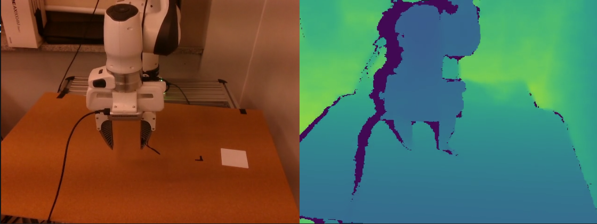

# Real Robot Data Collection & Teleoperation Pipeline

This repository provides a **real-robot data collection and teleoperation pipeline** built on top of **Diffusion Policy**.
It supports **Franka Research 3 (FR3)** control, **Xbox controller teleoperation**, and **RGB-D data collection** using RealSense cameras.

---

## Install

### Dependencies

* **Diffusion Policy (Real Robot setup)**
  This repository is based on the official Diffusion Policy implementation for real robots:

  👉 [https://github.com/real-stanford/diffusion_policy?tab=readme-ov-file#-real-robot](https://github.com/real-stanford/diffusion_policy?tab=readme-ov-file#-real-robot)

* **ManiWAV**
  This repository is based on the official Diffusion Policy implementation for real robots:

  👉 [https://github.com/real-stanford/maniwav/tree/main](https://github.com/real-stanford/maniwav/tree/main)

* **Franky (Franka robot control library)**
  Robot control is implemented using the Franky library:

  👉 [https://github.com/TimSchneider42/franky](https://github.com/TimSchneider42/franky)

Please follow the installation instructions in the above repositories before running this code.

---

## Updates
### ver 0.1
* ✅ Added **Franka Research 3 (FR3)** control support
* ✅ Added **depth data collection** (optional, can be enabled/disabled)
* ✅ Added **Xbox controller teleoperation**
* ✅ Added **gripper control** and gripper state logging

  * Gripper state is stored in the **last index of the end-effector (EEF) pose**

### ver 0.2
 * ✅ Added **Realsense D405** support
 * ✅ Fix **Franka Research 3 (FR3)** control delay

**Depth data collection example:**



---

## Run

```bash
python demo_real_robot.py \
  --output {path/to/data/dir} \
  --robot_ip  {@@@.@@@.@@@.@@@} \
  --teleop_mode {xbox_controller}\
  --robot_model {fr3}
```

### Arguments

* `-o` : Output directory for collected data
* `--robot_ip` : IP address of the robot controller
* `--teleop_mode` : Teleoperation mode (`xbox_controller`)
* `--robot_model` : Robot model (`fr3`)

---

## Troubleshooting

* **Depth data latency**
  When collecting depth images, use a **low resolution** to reduce latency:

  ```text
  (width, height) = (640, 480)
  ```

* **Tested hardware setup**

  * Franka Research 3 (FR3)
  * Xbox controller
  * Intel RealSense D435 × 2

Other configurations are not yet fully validated.

---

## To Do

* ⏳ Add **multi-modal data collection pipeline** (audio, tactile, etc.)
* ⏳ Add **VR-based teleoperation mode**
* ⏳ Add **xArm 7 control support**
* ⏳ Add **Dexterous hand support**
* ⏳ Add **Data convertion to RLDS**
